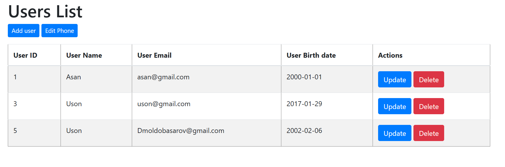
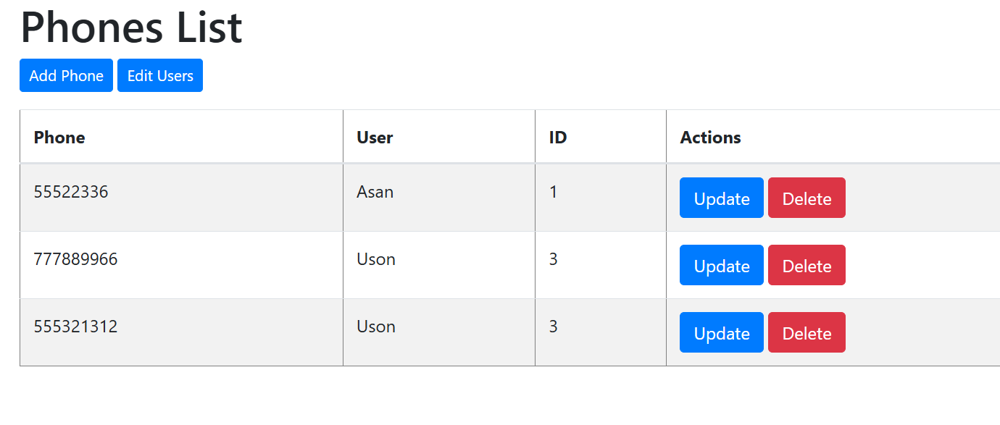

# Phone Management System
### Описание проекта
Phone Management System — это веб-приложение для управления пользователями и их телефонными номерами. Оно позволяет выполнять базовые CRUD-операции, такие как добавление, редактирование, удаление и просмотр данных.

### Функционал
#### Пользователи
- Добавление нового пользователя.
- Просмотр списка пользователей.
- Редактирование данных пользователя.
- Удаление пользователя.
#### Телефоны
- Добавление телефона для пользователя.
- Просмотр списка телефонов.
- Редактирование телефона.
- Удаление телефона.
### Технологии
- Язык программирования: Java 17
- Фреймворк: Spring Boot
- База данных: MySQL
- Фронтенд: Thymeleaf
- Сборка проекта: Maven
### Установка и запуск
Клонируйте репозиторий:
```bash
git clone https://github.com/donny-cap/test-webapp.git
```
Перейдите в папку проекта:
```bash
cd test-application
```
Соберите проект:
```bash
mvn clean install
```
Запустите приложение:
```bash
mvn spring-boot:run
```
Откройте приложение в браузере по адресу: http://localhost:8080.
### Скриншоты
1. Список пользователей

2. Список телефонов
 
